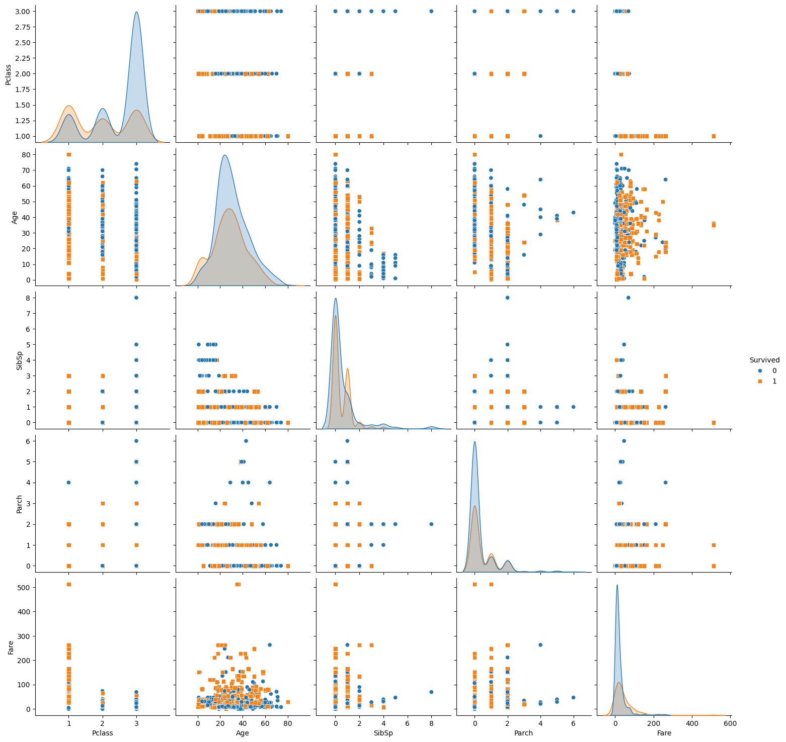

Group 7 report about Titanic incident analyzing

Abstract 
This report was written to create a model capable of predicting whether a traveler survived or not. In the model, Gender, Age and Pclass will be included and we will use two machine learning method which is Linear regression and Logistic regression to predict survival chance. Two model will be compared to each other and to the base to find predicting accuracy. Lastly, we will try to deduce the result that we have.

1. Introduction

Titanic has always been an disaster when talking about voyage. The incident took place way back on April 15th, 1912, when the Titanic
sank during its first voyage after striking an iceberg, resulting in the tragic loss of 1502 passengers and crew out of a total of 2224.This sensational tragedy
horrified the international community and led towards action taking by formulating better safety regulations for ships. While it is still controversial about who took responsibility of the incident, we can agree that there are certain characteristics share between survivors. In this report, we try to find out what features will likely make a individual survive in the Titanic incident and perhaps in a disaster as a whole.

2. Methodology

2.1. Source of data

We will use the provided data which come from Kaggle. Kaggle give us two excel files which include file for training and for testing model. We intend to use one file for training and one file for testing but we find out the the testing file did not include the survived index so in this report the only file that we use will be 
2.2. Variable

2.2.1. Data dictionary
The table was provided by Kaggle. 

2.2.2. Variable Selection
There are many variable provided, but in the model, we decide to use only three independent variables which is Sex, Age and Pclass. For dependent variable, we will use survived for our model. 
The reason why only three were selected because we want to keep our model clear enough for us to analyse, beside some variable are not need for the model like Passengerid, Name, Ticket or even Fair(as it might have a correlation to the Pclass). Also, we do not want our model to have 'Curse of dimentionality' or 'Multicollinearity'. But why is this three variable instead of others? This actually have a quanlitative reason. We have read some article about this incident and we figure out some attribute of the survivor which related more to their age, gender and their wealth than the other so we decide to build a model based on them.

2.3. Preprocessing data

The data that we receive is not cleaned. There are numerous of null value in the Age column, beside the model can run on str data like what we have in Sex column.
For Age column we decide to drop all the null value, as the Age of a passager is not depend on the other on the ship, so we think to fill in all the null value by mean or median of the column might have a negative effect on our model. More accurate age prediction will involve machine learning model, which we believe is not the focus in this course so we will not add it into our research. 
For Sex column, we will convert the male/female into 1/0 using:
X['Sex'] = X['Sex'].apply(lambda x: 1 if x == 'male' else 0)

2.4. Models Used
For this project, two model was selected:
1. Linear regression model  
2. Logistic regression model

Before using this model we used a pair plot to simply visualize the model.

We believe the distribution is 'normal' enough to perform a regression model.

3. Result
3.1 Linear regression
After training the model, we have an output which is this equation:
ŷ= 0.40 + -0.16 * Pclass + -0.07 * Age + -0.22 * Sex

e
