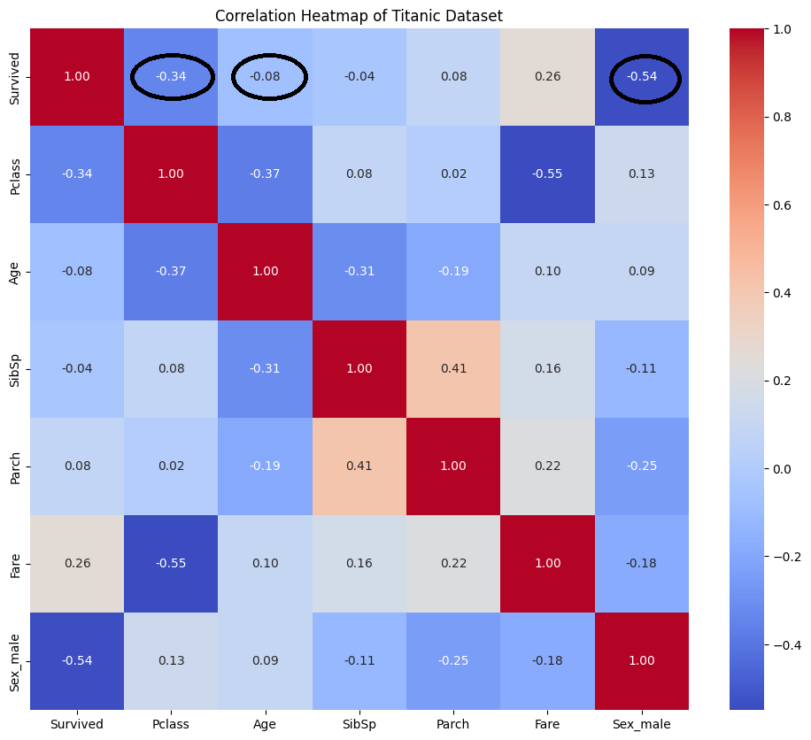
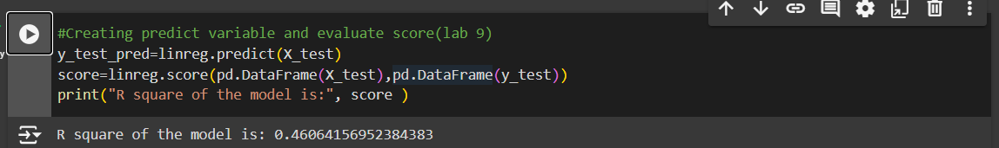

# Group 7 Report: 🚢 Titanic Incident Analyzing

`Abstract:`

**`This report was written to create a model capable of predicting whether a traveler survived or not. `**

**`In the model: Gender,Age & Pclass will be included and we will use 2 Machine Learning Method (Linear regression) `**

---

## I. Introduction
Incident can happen anytime in any era. While it takes away money, asset and human life sometimes it still can spare some survivors. 

When looking at the data about some incident, we question ourself, are survivors predictable? 

Looking at the chart you can see that with the change in gender the percent that one can survive have already been significantly different.  

In other words, we want to find out a feature that will make an individual more likely to survive in an incident. 

This report will use some predict model to answer this question. 

While there is many infamous incident, the data we will use belong to Titanic incident which happen in 1911. 

On that ship in 4/1911, there was 2204 and there was only 1502 people suvived.

---

## II. Methodology

### 2.1. Source of data

We will use the provided data which come from Kaggle. 

Kaggle give us two excel files which include file for training and for testing model. We will only use train.csv for our model.

### 2.2. Variable

### 2.2.1. Data dictionary

The table was provided by Kaggle. 

### 2.2.2. Variable Selection

In the model we created, we will only use three variable which is Sex, Age and Pclass.

### 2.2.3. Preprocessing data

As the age is hard to predict, for null value in the Age column, we decide to drop it. 

As for Sex, we will change variable into 1/0(male/female).

### 2.2.4. Model
In this report the only model will be use which is linear regression model.

---

## III. Result

After training our model we come up with a equation like below:

ŷ= 0.40 + -0.16 * Pclass + -0.07 * Age + -0.22 * Sex

This equation indicate that the decrease in Pclass and the increase in Age will lead to the decrease in the total resule. If the gender is male(which is one in the model) will also decrease the survivor chance.

But is this model reliable? If we looking at OLS Regression Result, we can see that the all of the P-value is really small, which is a good sign as every varible that we use are significant. 

But when we looking at the R square, it was not really good. 0.37 presents not a strong relationship but infact it is actually a moderate relationship. 

So, should we keep trusting the model? Even though the R square is not significant enough, I think the model that we create is still acceptable.

Beside, when we using score funcition to evaluate the R square it give us 0.46 which is a better result.

---

## IV. Discussion

When analyzing this model, it tells us something about the attribute that make we survive. 

First: Gender & Age - it actually is commonsense. In every incident, woman, the young and the old is always priority. They are the group which are more likely to receive a rescue boat than the male and adult. It may also explain why the Age value in the model has the coefficent at only 0.08 as not only the young being priority but also the old. 

Second: PClass - it highly recommend that if you book the higher class in a cuisine, it is more likely that you will survived. Perhaps, it happens as the higher class in a voyager is equiped with more emergency equipment that those from lower class, they have more chance to access rescue transportation than the other.

---

## V. Conclusion

In the last, we want to disclaim that, there will be other models which have the capability to explain the data better than the model we use, but the linear model that we use can easily understand and analyze for most of people. 

Another thing we want to discuss is that this incident is quite "specific", as there are many kind of transportation accident, plus Titanic happened along time ago so it might be a little out of date with the technology, mindset and culture today. 

But we highly believe that the attribute we chose which is sex, age and pclass in any era still have a big impact in the survival rate of a passenger.
