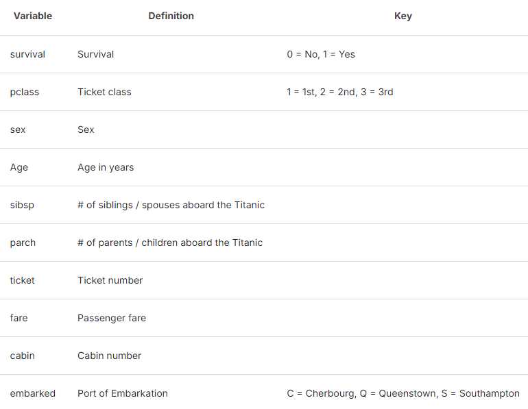
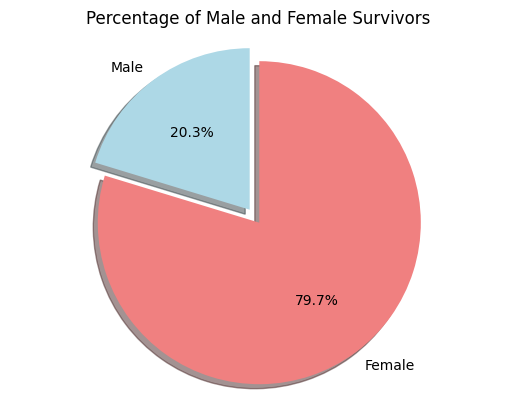
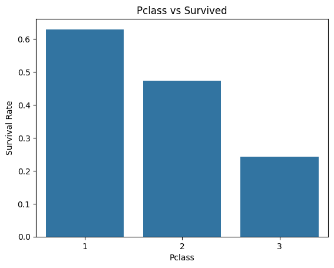
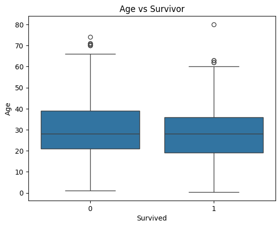
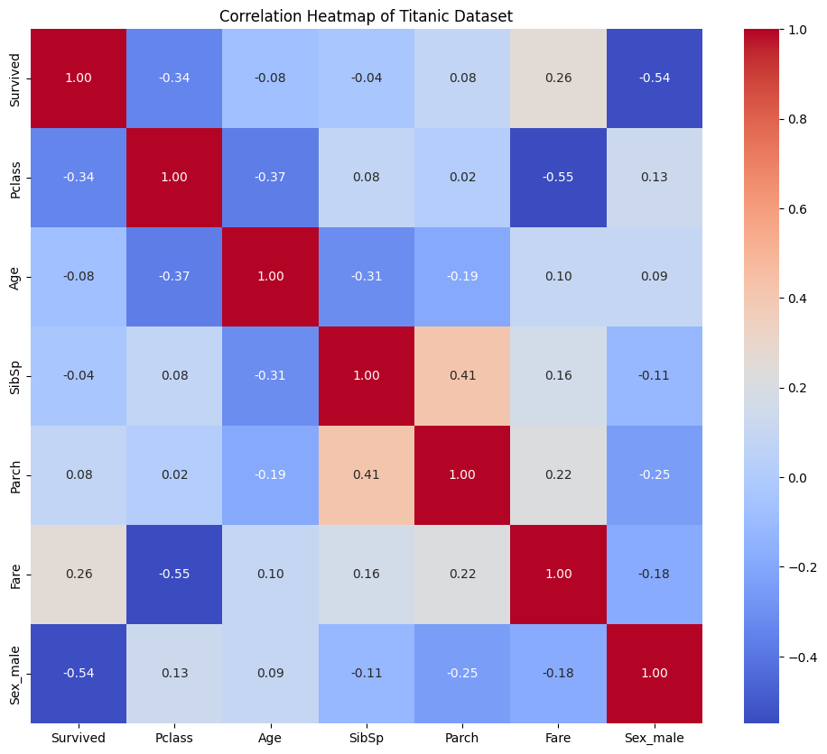
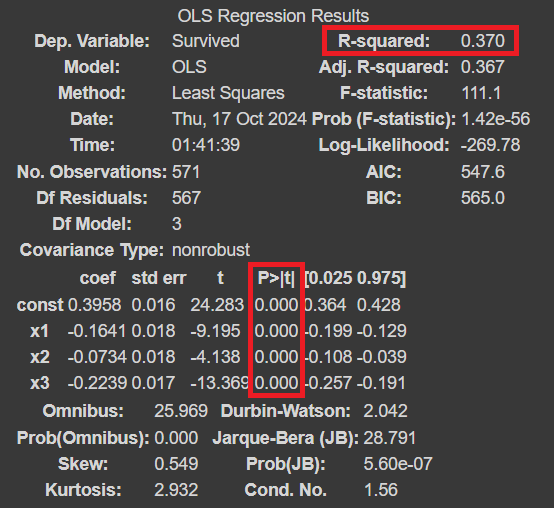

# Group 7 Report: 🚢 Titanic Incident Analyzing

| **Members** | Code |
| --- | --- |
| **Phạm Xuân Hưng** | `22080317` |
| **Vũ Tiến Phúc** | `22080336` |
| **Trần Kim Quang Minh** | `22080329` |
| **Nguyễn Văn Ngọc Sơn** | `22080341` |
| **Lương Việt Hoàng** | `22080313` |

***`Abstract:`***

`This report was written to create a model capable of predicting whether a traveler survived or not `

`In the model: Gender, Age & Pclass will be included and we will use Machine Learning Method (Linear regression) `

---

## I. Introduction
- Incident can happen anytime in any era. While it takes away money, asset and human life sometimes it still can spare some survivors. 

- When looking at the data about some incidents, we question ourselves, are survivors predictable? 

- In this report, we will visualize some data in the given file by some chart, to give a clearer picture about the answer to the question above

- Beside, we will have a bonus part which include a simple regression model to predict with the given input, whether an individual will survive or not.

---

## II. Data processing

### 2.1. Source of data

We will use the provided data which comes from Kaggle. 

Kaggle gives us two excel files which include file for training and for testing model. But as the testing is provided for testing the model and not included the the data about whether the people in there survived or not, we decide to just using the the train.csv file.

The data is about the Titanic incident which happened in 4/1911. From 2204 individuals on that ship, there was only 1502 people suvived after the accident.

Eventhough there was 2204 individuals on the ship, the file we receive only contain data of 890 people.

### 2.2. Data dictionary

The table was provided by Kaggle. 

`**Note**`: In the progress, we will change variable in Sex column into **1 (male) / 0 (female)** to make the caculation and coding easier

## III. Analyzing Charts

**3.1. Pie chart about Sex and Survived**
This chart was made to compare the percentage of female and male in the survivor.

It can be tell from the chart that if someone is a female, she will have chance to survive in the Titanic incident. While the chart did not indicate that if you are a male, the percentage that you will live is 20.3%, it highlight the significant difference in the percent of female to male in the survival data.

**3.2. Bar chart about PClass and Survived**

This bar chart was made to compare the survival rate of each class in the Pclass with:
- 1 - first class (the highest class)
- 2 - second class
- 3 - third class.

It is clearly to see the higher the class ticket that we bought, the more survival rate that we will have.

**3.3. Box plot about Age and Survived**

In the boxplot, 1 stand for survived and 0 stand for non-survived. Median of both boxplot is around 28 but the part from first quartile to median of the survivor is bigger than the non survivor and there is a constrast in the part from median to third quartile that the survivors tend to be younger than the non-survival which suggest that the age of the survival tend to be younger. Both have outliers but it seem like the elder tend to be non-survivor than survivor.

**3.4. Heat map**

The heat map showing the correlation with variable to each other. It can be tell from the heat map that Pclass, Age, Fare, Sex and Parch(the number of parents/children abroad Titanic) have the highest correlation to the survival rate. Although, Fare also have a high correlation with survived, it also have a high correlation with PClass. It is obvious as Fare is the amount of money you pay for the ticket. It suggest that we should use just one of the variable if we intend to do regression as it might cause multicollinear.

## IV. Regression

We used linear regression model with three variable which is Pclass, Age and Sex

**`ŷ= 0.40 + -0.16 * Pclass + -0.08 * Age + -0.23 * Sex `**

- This equation indicates that the decrease in Pclass & the increase in Age will lead to the decrease in the total result. If the gender is male(which is one in the model) will also decrease the survivor chance.

- Is this model reliable? If we look at OLS Regression Result, we can see that **all of the P-value is really small**, which is a good sign as every variables that we use are significant. 

But when we look at the R square: **0.37** - not a really good & strong relationship but in fact, it is actually a moderate relationship. 

So, should we keep trusting the model? Even though the R square is not significant enough, I think the model that we create is still acceptable as the provided data has a lot of missing data.

---

## IV. Discussion

From the chart and the model, it tells us something about the attribute that makes we survive:

- First: **Gender & Age** - it is actually commonsense. In every incidents, woman, the young and the old is always priority. They are the group which are more likely to receive a lifeboat than the male and adult. 

- Second: **PClass** - it highly recommends that if you book the higher class in a voyage, it is more likely that you will survived. Perhaps, it happens as the higher class in a voyager is equipped with more emergency equipment that the individuals from lower class have more chance to access rescue transportation than the other people in different classes.

---

## V. Conclusion

- In the last, we want to disclaim that, this incident is quite "specific", as there are many kinds of transportation accidents, plus Titanic happened along time ago so it might be a little out of date with the technology, mindset and culture today. So using it as the data to build a prediction model might not really good. But we highly believe that the attribute we visualized which is sex, age and pclass in any era still have a big impact in the survival rate of a passenger.
